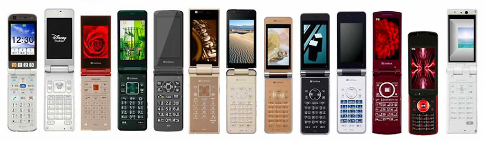

# Mobile Phone Evolution Slideshow
This project aims to create an interactive slideshow that showcases the evolution of mobile phones. The goal is to provide an engaging educational tool for children and anyone interested in understanding how mobile technology has progressed over the years.

[Link to live demo](https://oishylea.github.io/MobilePhoneEvolution/)

## Problem Definition
The project aims to educate younger generations about the evolution of mobile phones through an interactive slideshow. By showcasing various mobile phones from different eras, users can appreciate the technological advancements and design changes over time. This is particularly important as many younger individuals have never experienced older phone models, such as flip phones with keypads.

## Problem Analysis
- **Target Audience**: Young children and teenagers who may not be familiar with older mobile phone technology.
- **Educational Value**: Provide historical context and technological advancements in mobile phones.
- **User Engagement**: Create an interactive experience that captivates users through visuals and concise descriptions.

## UI
- **Slideshow Interface**: A responsive design that allows users to navigate through different phone models easily.
- **Content Display**:
  - **Image of the Phone**: A clear picture representing each phone model.
  - **Phone Name**: The model name is prominently displayed.
  - **Features**: Key features of the phone are succinctly listed.
  - **Description**: A brief overview of the phone’s significance in mobile history.
  - **Navigation Controls**: Simple buttons to move forward and backward through the slideshow.
  - **Video Demonstration**: How people use.

## Coding
- **Technologies Used**: 
  - HTML, CSS, and JavaScript for building the interactive slideshow.
  - Potential libraries: jQuery or a lightweight slideshow library for smooth transitions.
- **Code Structure**:
  - HTML for markup of the slideshow and content.
  - CSS for styling and ensuring responsiveness across devices.
  - JavaScript for interactive functionality, including event listeners for navigation.

## Debugging
- **Testing Browsers**: Ensure compatibility across major web browsers (Chrome, Firefox, Safari).
- **Responsive Design**: Check functionality on various screen sizes, especially mobile devices.
- **Functionality Testing**: Verify that all interactive elements (e.g., navigation buttons) work as intended.

## Maintenance
- **Content Updates**: Periodically add new phone models or update existing ones as technology evolves.
- **Feedback Mechanism**: Implement a way for users to provide feedback on the slideshow experience.
- **Bug Fixes**: Address any reported issues promptly to ensure a smooth user experience.

## Idea References
[Evolution of the mobile phone](https://www.tigermobiles.com/evolution/#firstPhone) 
[Source Code Reference 1](https://www.youtube.com/watch?v=hfGz5AgHT-E&list=PLe28tn1x4EIZE0Rp8xakXrvPY7m63_6Oc&index=4) 
[Source Code Reference 2](https://www.youtube.com/watch?v=nRB49gj6sVA&t=114s) 
